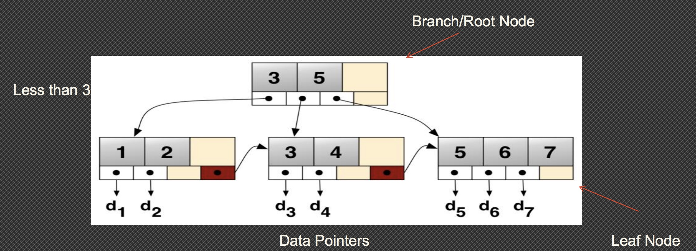

# MySQL5.6 索引最佳实践

>
这是 [文章](https://www.percona.com/live/europe-amsterdam-2015/sites/default/files/slides/PLAM15-MySQL-Indexing-Best-Practices-for-MySQL-56.pdf) 的翻译，在翻译过程中，会对其中涉及到的语句加上一些个人理解以及 SQL 语句的执行，并进行特别的标注。

### 1. 你做了一个很棒的选择，因为：
* 对于普通开发者和 DBA，理解索引都是非常重要的；
* 对于大量的生产环境上的问题，糟糕的索引要负有责任；
* 索引没有非常的高深。

### 2. MySQL 索引事项
* 理解索引；
* 为自己的应用选择最好的索引；
* 解决常见的 MySQL 限制。

### 3. 废话少数，索引有什么用？
* 可以更快的访问数据库；
* 可以增加强制限制（UNIQUE， FOREIGN KEY）；
* 没有索引的查询可以运行，但是可能会花费很长时间。

### 4. 你可能听过的一些索引类型
* B-Tree 索引：MySQL 中最主要的索引；
* RTREE 索引：仅仅是 MyISAM，GIS；
* 哈希索引：MyISAM，5.6 开始的 Innodb。

### 5. BTREE 索引家族
* 多种不同的实现：
   - 为了加速，都有相同的操作；
   - 内存和磁盘是需要考虑的两方面；

* B+Tree 是典型的磁盘存储：数据存储在页节点上；
* TokuDB Fractal Trees 在逻辑上是相似的：但是在物理存储上不同

### 6. B+ 树例子

### 7. MyISAM vs Innodb
* 在 MyISAM 中，数据指针指向数据文件的物理节点，所有的索引都是等价的；
* 在 Innodb 中，主键在页节点上存储数据，耳机索引存储主键作为数据指针。

### 8. BTREE 索引能做什么？
* 直接查看 KEY=5 的所有列；
* 找到 KEY > 5 的列，范围查找；
* 查找 5<KEY<10 之间的所有列，封闭范围查找；
* 不能找到 KEY 的最后一个数字是 0 的列（这个不是范围查找）。

### 9. 字符串索引

